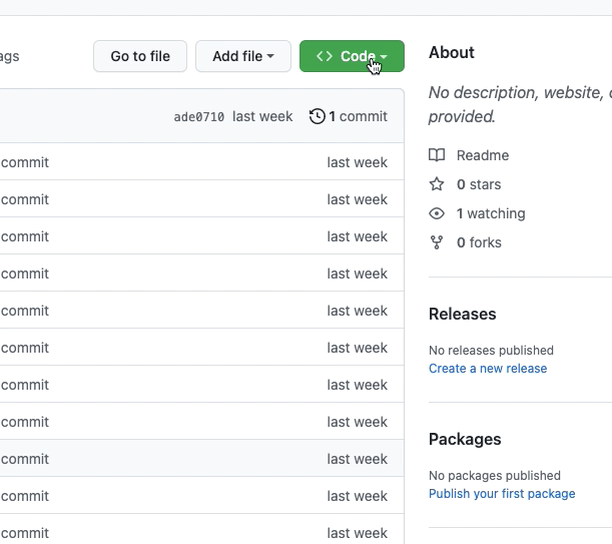

# Academy dbt Group Training
Welcome to dbt Group training! 

*This repo can be accessed using the link:*
## **https://xebia.ai/codespace-dbt**

## Overview + Set-up Instructions
This training session is designed to provide a comprehensive understanding 
of dbt, covering its core concepts and functionalities. You will 
learn how to use dbt to build and maintain data models, perform data 
transformations, and ensure data quality through rigorous testing and documentation.

This training runs entirely on **DuckDB**, a fast embedded database that lives in
a single file inside your codespace. There are **no credentials, tokens, cloud
accounts or warehouses** to set up — when your codespace finishes building, the
data is already loaded and you can start straight away.

### Step 1: Create a new codespace

Click 'Code', then 'Codespaces', then 'Create codespace on main'.



This creates a `codespace`: a sandbox with everything you need for the training.
While it builds, it installs dbt + the DuckDB adapter and loads the raw jaffle
data for you. Wait for it to finish before continuing.

### Step 2: Run the project

Everything you need is already in place. From the terminal:

```bash
cd jaffle_shop
dbt run
```

That's it — dbt builds the models into your local DuckDB database
(`jaffle_shop/jaffle_shop.duckdb`). You can also try `dbt build`, `dbt test` and
`dbt docs generate && dbt docs serve`.

> **Tip:** the raw data is loaded automatically when the codespace is built. If
> you ever want to reload it yourself (you will, during the Sources lesson), run
> `dbt seed` from inside the `jaffle_shop` folder — it is safe to re-run.

### Step 3: Check what you've built

The simplest way to look at the data is the ready-made queries in
**`jaffle_shop/analyses/scratchpad.sql`**. Open it, highlight a query, and run it
with the **dbt Power User** extension's *Preview* (or your SQL tool of choice) to
see the results — no need to write any SQL. It contains a `select` for each raw
source table (`raw_jaffle_shop.customers`, `orders`, `payments`) and for the
models you build with `dbt run` (e.g. `dbt_dev.customers`).

Everything lives in two schemas inside the single `jaffle_shop.duckdb` file:
**`raw_jaffle_shop`** (the raw source data) and **`dbt_dev`** (your own models).

> Want a free-form SQL shell instead? The **DuckDB CLI** is pre-installed too —
> run `duckdb jaffle_shop.duckdb` from the `jaffle_shop` folder, then try
> `SHOW ALL TABLES;` or `SELECT * FROM dbt_dev.customers;`.

#### (Optional) Use your own schema

By default your models build into the `dbt_dev` schema. If you want an isolated
schema — for example to compare your work with a colleague's — set `DBT_SCHEMA`
before running dbt:

```bash
export DBT_SCHEMA=dbt_<initial><last_name>
```

## Data Overview

### Jaffle data
The Jaffle data set will be used throughout this training. Jaffle data is a 
sample dataset that simulates a simple e-commerce store, including customers, 
orders, and payments. This dataset provides a practical context for learning 
and applying dbt concepts, making it easier to understand real-world applications of dbt.

## Agenda - dbt Group Training

### 1. dbt Fundamentals
Introduction to the basics of dbt, including its purpose, key components, and 
how it integrates into the modern data stack. Concepts such as models, runs, builds and 
configurations will be explained.

### 2. Sources
Instructions on how to define and manage data sources in dbt. The session will 
cover the importance of sources, how to declare them in a dbt project, and best 
practices for managing source freshness.

### 3. Documentation
Exploration of how to document dbt models and projects effectively. The 
importance of maintaining documentation and using dbt's built-in documentation 
features to keep projects organized and understandable will be discussed.

### 4. Tests
Guidance on writing and running tests in dbt, including schema tests and data tests, 
to ensure transformations produce accurate results. Emphasis will be placed on the 
importance of testing for data integrity.

### 5. Macros and Jinja
Understanding the power of dbt macros and the Jinja templating language. The 
session will cover how to write reusable SQL snippets using macros and leverage 
Jinja to make dbt models more dynamic and flexible.

### 6. Materializations
Overview of different types of materializations in dbt, such as views, tables, 
and incremental models. Discussion on when and why to use each type, and how to 
configure them in a dbt project.

### 7. Incremental Models
Explanation of incremental models and their significance for efficient data processing. 
Instructions on how to set up and manage incremental models in dbt to process large 
datasets incrementally rather than reprocessing everything from scratch.
